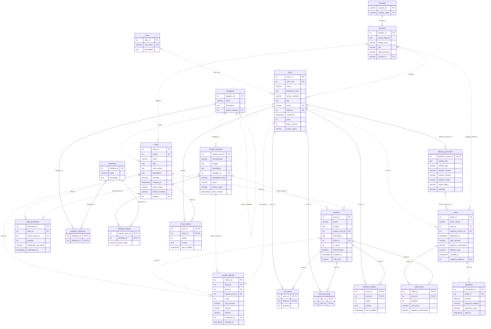

# ShopSphere schema and ERD

Generated from `server/sql/schema.sql` by `python3 scripts/document-schema.py`.
The schema contains **21 application tables**. `schema_migrations` is added by the migration runner.

## Entity relationships

The ERD reflects SQL nullability and cardinality, including optional references.
Solid edges identify a child through its foreign key; dotted edges are non-identifying.
`o{` means zero or many, `o|` zero or one, and `||` exactly one.

## Relational definitions

Composite PK means that the listed PK columns jointly identify a row.
Required reflects NOT NULL/PK and the later status-column ALTER statements.
Refer to the SQL file for exact CHECK expressions, identity generation and defaults.

### countries

| Column | SQL type | Key | Required | Definition |
| --- | --- | --- | --- | --- |
| `country_id` | `VARCHAR` | PK | Yes | PRIMARY KEY |
| `country_name` | `VARCHAR` | — | Yes | not null UNIQUE |

### locations

| Column | SQL type | Key | Required | Definition |
| --- | --- | --- | --- | --- |
| `location_id` | `INT` | PK | Yes | GENERATED ALWAYS AS IDENTITY PRIMARY KEY |
| `street_address` | `TEXT` | — | Yes | not null |
| `postal_code` | `VARCHAR` | — | No |  |
| `city` | `VARCHAR` | — | Yes | not null |
| `state_province` | `VARCHAR` | — | No |  |
| `country_id` | `VARCHAR` | FK | Yes | REFERENCES countries(country_id) on delete cascade not null |

### roles

| Column | SQL type | Key | Required | Definition |
| --- | --- | --- | --- | --- |
| `role_id` | `INT` | PK | Yes | GENERATED ALWAYS AS IDENTITY PRIMARY KEY |
| `role_name` | `VARCHAR` | — | Yes | not null UNIQUE |
| `description` | `TEXT` | — | No | default null |

### users

| Column | SQL type | Key | Required | Definition |
| --- | --- | --- | --- | --- |
| `user_id` | `INT` | PK | Yes | GENERATED ALWAYS AS IDENTITY PRIMARY KEY |
| `user_role` | `INT` | FK | No | REFERENCES roles(role_id) on delete set null |
| `name` | `VARCHAR` | — | Yes | not null |
| `password_hash` | `TEXT` | — | Yes | not null |
| `phone_numbers` | `VARCHAR(20)` | — | No |  |
| `pfp` | `TEXT` | — | No |  |
| `email` | `varchar(60)` | — | Yes | unique not null |
| `address` | `INT` | FK | No | REFERENCES locations(location_id) on delete set null |
| `created_at` | `TIMESTAMP` | — | No | DEFAULT CURRENT_TIMESTAMP |
| `point` | `int` | — | Yes | default 0 not null |
| `token_version` | `INT` | — | Yes | NOT NULL DEFAULT 0 |
| `active_status` | `varchar` | — | Yes | check(active_status in ('active','disabled')) default 'active' |

### shops

| Column | SQL type | Key | Required | Definition |
| --- | --- | --- | --- | --- |
| `shop_id` | `INT` | PK | Yes | GENERATED ALWAYS AS IDENTITY PRIMARY KEY |
| `owner` | `INT` | FK | Yes | REFERENCES users(user_id) not null |
| `name` | `VARCHAR` | — | Yes | not null |
| `logo` | `TEXT` | — | No |  |
| `cover_photo` | `TEXT` | — | No |  |
| `description` | `TEXT` | — | No |  |
| `earnings` | `decimal` | — | No | default 0 |
| `created_at` | `TIMESTAMP` | — | No | DEFAULT CURRENT_TIMESTAMP |
| `active_status` | `varchar` | — | Yes | check(active_status in ('active','disabled','pending')) default 'active' |
| `phone_numbers` | `VARCHAR(20)` | — | No |  |
| `address` | `INT` | FK | No | REFERENCES locations(location_id) on delete set null |

### categories

| Column | SQL type | Key | Required | Definition |
| --- | --- | --- | --- | --- |
| `category_id` | `INT` | PK | Yes | GENERATED ALWAYS AS IDENTITY PRIMARY KEY |
| `name` | `VARCHAR` | — | Yes | not null |
| `description` | `TEXT` | — | No |  |
| `parent_category` | `INT` | FK | No | REFERENCES categories(category_id) on delete cascade default null |

### master_products

| Column | SQL type | Key | Required | Definition |
| --- | --- | --- | --- | --- |
| `master_prod_id` | `INT` | PK | Yes | GENERATED ALWAYS AS IDENTITY PRIMARY KEY |
| `manufacturer` | `VARCHAR` | — | Yes | not null |
| `images` | `TEXT` | — | No |  |
| `description` | `TEXT` | — | No |  |
| `category_id` | `INT` | FK | Yes | REFERENCES categories(category_id) on delete restrict not null |
| `wholesale_price` | `NUMERIC(12,2)` | — | Yes | NOT NULL CHECK (wholesale_price >= 0) |
| `name` | `VARCHAR` | — | Yes | not null |
| `active_status` | `VARCHAR` | — | Yes | check(active_status in ('available','discontinued')) default 'available' |
| `date_created` | `TIMESTAMP` | — | No | default CURRENT_TIMESTAMP |

### products

| Column | SQL type | Key | Required | Definition |
| --- | --- | --- | --- | --- |
| `prod_id` | `INT` | PK | Yes | GENERATED ALWAYS AS IDENTITY PRIMARY KEY |
| `name` | `VARCHAR` | — | Yes | not null |
| `images` | `TEXT` | — | No |  |
| `master_prod_id` | `INT` | FK | Yes | REFERENCES master_products(master_prod_id) on delete restrict not null |
| `description` | `TEXT` | — | No |  |
| `shop_id` | `INT` | FK | Yes | references shops(shop_id) not null |
| `in_stock` | `INT` | — | Yes | NOT NULL DEFAULT 0 CHECK (in_stock >= 0) |
| `discontinued` | `boolean` | — | Yes | default false |
| `created_at` | `TIMESTAMP` | — | No | DEFAULT CURRENT_TIMESTAMP |
| `unit_price` | `NUMERIC(12,2)` | — | Yes | NOT NULL CHECK (unit_price >= 0) |

### shop_purchases

| Column | SQL type | Key | Required | Definition |
| --- | --- | --- | --- | --- |
| `purchase_id` | `INT` | PK | Yes | GENERATED ALWAYS AS IDENTITY PRIMARY KEY |
| `shop_id` | `INT` | FK | Yes | REFERENCES shops(shop_id) ON DELETE RESTRICT NOT NULL |
| `master_prod_id` | `INT` | FK | Yes | REFERENCES master_products(master_prod_id) ON DELETE RESTRICT NOT NULL |
| `quantity` | `INT` | — | Yes | NOT NULL CHECK (quantity > 0) |
| `wholesale_unit_price` | `NUMERIC(12,2)` | — | Yes | NOT NULL CHECK (wholesale_unit_price >= 0) |
| `purchased_at` | `TIMESTAMP` | — | Yes | NOT NULL DEFAULT CURRENT_TIMESTAMP |

### vendor_refunds

| Column | SQL type | Key | Required | Definition |
| --- | --- | --- | --- | --- |
| `refund_id` | `INT` | PK | Yes | GENERATED ALWAYS AS IDENTITY PRIMARY KEY |
| `shop_id` | `INT` | FK | Yes | REFERENCES shops(shop_id) ON DELETE RESTRICT NOT NULL |
| `prod_id` | `INT` | FK | Yes | REFERENCES products(prod_id) ON DELETE RESTRICT NOT NULL |
| `master_prod_id` | `INT` | FK | Yes | REFERENCES master_products(master_prod_id) ON DELETE RESTRICT NOT NULL |
| `units` | `INT` | — | Yes | NOT NULL CHECK (units >= 0) |
| `unit_amount` | `NUMERIC(12,2)` | — | No |  |
| `amount` | `NUMERIC(12,2)` | — | Yes | NOT NULL CHECK (amount >= 0) |
| `reason` | `VARCHAR` | — | Yes | NOT NULL CHECK (reason IN ('admin_removal', 'shop_closed')) |
| `removed_by` | `INT` | FK | Yes | REFERENCES users(user_id) ON DELETE RESTRICT NOT NULL |
| `created_at` | `TIMESTAMP` | — | Yes | NOT NULL DEFAULT CURRENT_TIMESTAMP |

### attributes

| Column | SQL type | Key | Required | Definition |
| --- | --- | --- | --- | --- |
| `attribute_id` | `INT` | PK | Yes | GENERATED ALWAYS AS IDENTITY PRIMARY KEY |
| `name` | `VARCHAR` | — | Yes | not null |
| `description` | `TEXT` | — | No |  |

### category_attributes

| Column | SQL type | Key | Required | Definition |
| --- | --- | --- | --- | --- |
| `category_id` | `INT` | PK FK | Yes | REFERENCES categories(category_id)on delete cascade not null |
| `attribute_id` | `INT` | PK FK | Yes | REFERENCES attributes(attribute_id)on delete cascade not null |

### attribute_values

| Column | SQL type | Key | Required | Definition |
| --- | --- | --- | --- | --- |
| `master_prod_id` | `INT` | PK FK | Yes | REFERENCES master_products(master_prod_id) on delete cascade not null |
| `attribute_id` | `INT` | PK FK | Yes | REFERENCES attributes(attribute_id) on delete cascade not null |
| `attrib_value` | `VARCHAR` | — | Yes | not null |

### cart_items

| Column | SQL type | Key | Required | Definition |
| --- | --- | --- | --- | --- |
| `user_id` | `INT` | PK FK | Yes | REFERENCES users(user_id) on delete cascade not null |
| `prod_id` | `INT` | PK FK | Yes | REFERENCES products(prod_id) on delete cascade not null |
| `quantity` | `INT` | — | Yes | NOT NULL CHECK (quantity > 0) |

### wish_list_items

| Column | SQL type | Key | Required | Definition |
| --- | --- | --- | --- | --- |
| `user_id` | `INT` | PK FK | Yes | REFERENCES users(user_id) on delete cascade not null |
| `prod_id` | `INT` | PK FK | Yes | REFERENCES products(prod_id) on delete cascade not null |

### product_reviews

| Column | SQL type | Key | Required | Definition |
| --- | --- | --- | --- | --- |
| `user_id` | `INT` | PK FK | Yes | REFERENCES users(user_id)on delete cascade not null |
| `prod_id` | `INT` | PK FK | Yes | REFERENCES products(prod_id)on delete cascade not null |
| `rating` | `INT` | — | Yes | check(rating between 1 and 5) not null |
| `review` | `TEXT` | — | No |  |
| `last_modified` | `TIMESTAMP` | — | No | DEFAULT CURRENT_TIMESTAMP |

### shop_reviews

| Column | SQL type | Key | Required | Definition |
| --- | --- | --- | --- | --- |
| `user_id` | `INT` | PK FK | Yes | REFERENCES users(user_id) on delete cascade not null |
| `shop_id` | `INT` | PK FK | Yes | REFERENCES shops(shop_id) on delete cascade not null |
| `rating` | `INT` | — | Yes | check(rating between 1 and 5) not null |
| `review` | `TEXT` | — | No |  |
| `last_modified` | `TIMESTAMP` | — | No | DEFAULT CURRENT_TIMESTAMP |

### delivery_personnel

| Column | SQL type | Key | Required | Definition |
| --- | --- | --- | --- | --- |
| `delivery_person_id` | `INT` | PK FK | Yes | references users(user_id) on delete restrict primary key |
| `vehicle_info` | `TEXT` | — | No |  |
| `vehicle_type` | `VARCHAR` | — | No |  |
| `vehicle_number` | `VARCHAR` | — | No |  |
| `license_number` | `VARCHAR` | — | No |  |
| `vehicle_model` | `VARCHAR` | — | No |  |
| `active_status` | `varchar` | — | Yes | check(active_status in ('available','on_delivery','unavailable')) default 'available' |
| `earnings` | `decimal` | — | No |  |

### orders

| Column | SQL type | Key | Required | Definition |
| --- | --- | --- | --- | --- |
| `order_id` | `INT` | PK | Yes | GENERATED ALWAYS AS IDENTITY PRIMARY KEY |
| `order_status` | `VARCHAR` | — | Yes | check(order_status in ('pending','shipped','delivered','cancelled')) default 'pending' |
| `user_id` | `INT` | FK | Yes | REFERENCES users(user_id) not null |
| `delivery_person_id` | `INT` | FK | No | REFERENCES delivery_personnel(delivery_person_id) default null |
| `delivered_at` | `TIMESTAMP` | — | No | default null |
| `total_amount` | `NUMERIC(12,2)` | — | Yes | NOT NULL DEFAULT 0 CHECK (total_amount >= 0) |
| `platform_commission` | `DECIMAL` | — | No | default 0 |
| `delivery_cost` | `NUMERIC(12,2)` | — | No | default 0 |
| `created_at` | `TIMESTAMP` | — | No | DEFAULT CURRENT_TIMESTAMP |
| `shipping_address` | `INT` | FK | Yes | REFERENCES locations(location_id)on delete restrict not null |

### payments

| Column | SQL type | Key | Required | Definition |
| --- | --- | --- | --- | --- |
| `transaction_id` | `INT` | PK | Yes | GENERATED ALWAYS AS IDENTITY PRIMARY KEY |
| `order_id` | `INT` | FK | Yes | REFERENCES orders(order_id) not null |
| `amount` | `DECIMAL` | — | Yes | not null |
| `payment_method` | `VARCHAR` | — | Yes | check(payment_method in ('prepaid','cash_on_delivery')) not null |
| `payment_status` | `VARCHAR` | — | Yes | check(payment_status in ('pending','completed','failed')) default 'pending' |
| `paid_at` | `TIMESTAMP` | — | No | DEFAULT CURRENT_TIMESTAMP |

### order_items

| Column | SQL type | Key | Required | Definition |
| --- | --- | --- | --- | --- |
| `order_id` | `INT` | PK FK | Yes | REFERENCES orders(order_id) not null |
| `prod_id` | `INT` | PK FK | Yes | REFERENCES products(prod_id) not null |
| `quantity` | `INT` | — | Yes | not null CHECK (quantity > 0) |
| `unit_price` | `NUMERIC(12,2)` | — | Yes | NOT NULL CHECK (unit_price >= 0) |
| `platform_commission` | `DECIMAL` | — | No | default 0 |

## Normalization and deliberate exceptions

- Country/location, role/user, shop/listing and category/master relationships separate independent facts.
- Many-to-many relationships use category_attributes, attribute_values, cart_items, wish_list_items, product_reviews, shop_reviews and order_items.
- Listing name/images duplicate master identity for compatibility with the original schema; master edits synchronize them through the API. Direct SQL maintenance must preserve this rule. This is a deliberate denormalization rather than a claim of strict 3NF for every table.
- Wholesale and order unit prices are historical snapshots. They must not change when current catalog prices change.
- Order total is a derived cache maintained by a trigger, and platform commission is a separate derived column per line and per order, so gross value and platform revenue never share a field.
- Points retain the existing schema but have no accounting policy; `users.point` is read and never written. Earnings and commission do have one, invented rather than supplied: see docs/REFUNDS_AND_READ_SURFACES.md.
- Attribute values are text (an entity/attribute/value model); category requirements are enforced on available masters at transaction commit.
- Images and phone_numbers currently store one URL/phone per row. Multi-image and multi-phone storage is not modeled as comma-separated lists.
- There is no permissions/role_permissions pair. Both were seed-only data no code consulted, and 009_drop_permissions.sql removed them; authorization is requireRole per mounted router.

## Trigger behavior

- Hard deletion is blocked for users, shops, master_products, products, delivery_personnel and orders; status fields preserve history.
- Removing a role disables affected users. Disabling a user disables their shops and makes their delivery profile unavailable.
- Disabling a shop discontinues listings. An unavailable courier releases pending/shipped assignments.
- Cancelling a pending order restores stock once, detaches its courier, marks pending payments failed and voids the platform commission; line items remain.
- Order status transitions are restricted; line-item changes recalculate both old and new order totals when moved.
- Product reviews require a delivered order for that exact customer/listing, and shop reviews require a delivered order for any listing from that shop, on both INSERT and UPDATE.
- Deferred category-value constraints validate masters, requirements and value edits atomically.

Country/category cascade deletes exist in the original DDL. There are no public country-delete endpoints, and the admin API rejects deletion of categories with children or master products. Shop-owner/delivery role ownership is enforced by API write paths, not by role-specific foreign keys.
