# ShopSphere schema and ERD

Generated from `server/sql/schema.sql` by `python3 scripts/document-schema.py`.
The schema contains **24 application tables**.

## Entity relationships

The ERD reflects SQL nullability and cardinality, including optional references.
Solid edges identify a child through its foreign key; dotted edges are non-identifying.
`o{` means zero or many, `o|` zero or one, and `||` exactly one.

```mermaid
erDiagram
    countries["countries"] {
        varchar2 country_id PK
        varchar2 country_name UK
    }
    locations["locations"] {
        number location_id PK
        varchar2 street_address
        varchar2 postal_code
        varchar2 city
        varchar2 state_province
        varchar2 country_id FK
    }
    roles["roles"] {
        number role_id PK
        varchar2 role_name UK
        clob description
    }
    users["users"] {
        number user_id PK
        number user_role FK
        varchar2 name
        clob password_hash
        varchar2 phone_numbers
        clob pfp
        varchar2 email UK
        number address FK
        timestamp created_at
        number point
        number token_version
        varchar2 active_status
    }
    shops["shops"] {
        number shop_id PK
        number owner FK
        varchar2 name
        clob logo
        clob cover_photo
        clob description
        number balance
        timestamp created_at
        varchar2 active_status
        varchar2 phone_numbers
        number address FK
    }
    categories["categories"] {
        number category_id PK
        varchar2 name
        clob description
        number parent_category FK
    }
    masterProducts["master_products"] {
        number master_prod_id PK
        varchar2 manufacturer
        clob images
        clob description
        number category_id FK
        number wholesale_price
        varchar2 name
        varchar2 active_status
        timestamp date_created
    }
    products["products"] {
        number prod_id PK
        varchar2 name
        clob images
        number master_prod_id FK
        clob description
        number shop_id FK
        number in_stock
        number discontinued
        timestamp created_at
        number unit_price
    }
    shopPurchases["shop_purchases"] {
        number purchase_id PK
        number shop_id FK
        number master_prod_id FK
        number quantity
        number wholesale_unit_price
        timestamp purchased_at
    }
    vendorRefunds["vendor_refunds"] {
        number refund_id PK
        number shop_id FK
        number prod_id FK
        number master_prod_id FK
        number units
        number unit_amount
        number amount
        varchar2 reason
        number removed_by FK
        timestamp created_at
    }
    shopTopups["shop_topups"] {
        number topup_id PK
        number shop_id FK
        number amount
        varchar2 method
        timestamp created_at
    }
    attributes["attributes"] {
        number attribute_id PK
        varchar2 name
        clob description
    }
    categoryAttributes["category_attributes"] {
        number category_id PK, FK
        number attribute_id PK, FK
    }
    attributeValues["attribute_values"] {
        number master_prod_id PK, FK
        number attribute_id PK, FK
        varchar2 attrib_value
    }
    cartItems["cart_items"] {
        number user_id PK, FK
        number prod_id PK, FK
        number quantity
    }
    wishListItems["wish_list_items"] {
        number user_id PK, FK
        number prod_id PK, FK
    }
    productReviews["product_reviews"] {
        number user_id PK, FK
        number prod_id PK, FK
        number rating
        clob review
        timestamp last_modified
    }
    shopReviews["shop_reviews"] {
        number user_id PK, FK
        number shop_id PK, FK
        number rating
        clob review
        timestamp last_modified
    }
    deliveryPersonnel["delivery_personnel"] {
        number delivery_person_id PK, FK
        clob vehicle_info
        varchar2 vehicle_type
        varchar2 vehicle_number
        varchar2 license_number
        varchar2 vehicle_model
        varchar2 active_status
        number earnings
    }
    orders["orders"] {
        number order_id PK
        varchar2 order_status
        number user_id FK
        number delivery_person_id FK
        timestamp delivered_at
        number total_amount
        number delivery_cost
        timestamp created_at
        number shipping_address FK
    }
    payments["payments"] {
        number transaction_id PK
        number order_id FK
        number amount
        varchar2 payment_method
        varchar2 payment_status
        timestamp paid_at
    }
    orderItems["order_items"] {
        number order_id PK, FK
        number prod_id PK, FK
        number quantity
        number unit_price
    }
    productReturns["product_returns"] {
        number return_id PK
        number order_id FK
        number prod_id FK
        number user_id FK
        number shop_id FK
        number quantity
        clob reason
        varchar2 status
        number refund_amount
        clob decision_note
        timestamp decided_at
        number collected_by FK
        timestamp collected_at
        timestamp restocked_at
        timestamp created_at
    }
    customerRefunds["customer_refunds"] {
        number refund_id PK
        number return_id FK
        number order_id FK
        number user_id FK
        number shop_id FK
        number amount
        timestamp created_at
    }
    countries ||..o{ locations : "country_id"
    roles |o..o{ users : "user_role"
    locations |o..o{ users : "address"
    users ||..o{ shops : "owner"
    locations |o..o{ shops : "address"
    categories |o..o{ categories : "parent_category"
    categories ||..o{ masterProducts : "category_id"
    masterProducts ||..o{ products : "master_prod_id"
    shops ||..o{ products : "shop_id"
    shops ||..o{ shopPurchases : "shop_id"
    masterProducts ||..o{ shopPurchases : "master_prod_id"
    shops ||..o{ vendorRefunds : "shop_id"
    products ||..o{ vendorRefunds : "prod_id"
    masterProducts ||..o{ vendorRefunds : "master_prod_id"
    users ||..o{ vendorRefunds : "removed_by"
    shops ||..o{ shopTopups : "shop_id"
    categories ||--o{ categoryAttributes : "category_id"
    attributes ||--o{ categoryAttributes : "attribute_id"
    masterProducts ||--o{ attributeValues : "master_prod_id"
    attributes ||--o{ attributeValues : "attribute_id"
    users ||--o{ cartItems : "user_id"
    products ||--o{ cartItems : "prod_id"
    users ||--o{ wishListItems : "user_id"
    products ||--o{ wishListItems : "prod_id"
    users ||--o{ productReviews : "user_id"
    products ||--o{ productReviews : "prod_id"
    users ||--o{ shopReviews : "user_id"
    shops ||--o{ shopReviews : "shop_id"
    users ||--o| deliveryPersonnel : "delivery_person_id"
    users ||..o{ orders : "user_id"
    deliveryPersonnel |o..o{ orders : "delivery_person_id"
    locations ||..o{ orders : "shipping_address"
    orders ||..o{ payments : "order_id"
    orders ||--o{ orderItems : "order_id"
    products ||--o{ orderItems : "prod_id"
    orders ||..o{ productReturns : "order_id"
    products ||..o{ productReturns : "prod_id"
    users ||..o{ productReturns : "user_id"
    shops ||..o{ productReturns : "shop_id"
    deliveryPersonnel |o..o{ productReturns : "collected_by"
    productReturns ||..o{ customerRefunds : "return_id"
    orders ||..o{ customerRefunds : "order_id"
    users ||..o{ customerRefunds : "user_id"
    shops ||..o{ customerRefunds : "shop_id"
```

## Relational definitions

Composite PK means that the listed PK columns jointly identify a row.
Required reflects NOT NULL and primary-key declarations in CREATE TABLE.
Refer to the SQL file for exact CHECK expressions, identity generation and defaults.

### countries

| Column | SQL type | Key | Required | Definition |
| --- | --- | --- | --- | --- |
| `country_id` | `VARCHAR2(10 CHAR)` | PK | Yes | PRIMARY KEY |
| `country_name` | `VARCHAR2(200 CHAR)` | — | Yes | NOT NULL UNIQUE |

### locations

| Column | SQL type | Key | Required | Definition |
| --- | --- | --- | --- | --- |
| `location_id` | `NUMBER(10)` | PK | Yes | GENERATED BY DEFAULT ON NULL AS IDENTITY PRIMARY KEY |
| `street_address` | `VARCHAR2(500 CHAR)` | — | Yes | NOT NULL |
| `postal_code` | `VARCHAR2(30 CHAR)` | — | No |  |
| `city` | `VARCHAR2(120 CHAR)` | — | Yes | NOT NULL |
| `state_province` | `VARCHAR2(120 CHAR)` | — | No |  |
| `country_id` | `VARCHAR2(10 CHAR)` | FK | Yes | REFERENCES countries(country_id) ON DELETE CASCADE NOT NULL |

### roles

| Column | SQL type | Key | Required | Definition |
| --- | --- | --- | --- | --- |
| `role_id` | `NUMBER(10)` | PK | Yes | GENERATED BY DEFAULT ON NULL AS IDENTITY PRIMARY KEY |
| `role_name` | `VARCHAR2(40 CHAR)` | — | Yes | NOT NULL UNIQUE |
| `description` | `CLOB` | — | No | DEFAULT NULL |

### users

| Column | SQL type | Key | Required | Definition |
| --- | --- | --- | --- | --- |
| `user_id` | `NUMBER(10)` | PK | Yes | GENERATED BY DEFAULT ON NULL AS IDENTITY PRIMARY KEY |
| `user_role` | `NUMBER(10)` | FK | No | REFERENCES roles(role_id) ON DELETE SET NULL |
| `name` | `VARCHAR2(300 CHAR)` | — | Yes | NOT NULL |
| `password_hash` | `CLOB` | — | Yes | NOT NULL |
| `phone_numbers` | `VARCHAR2(20 CHAR)` | — | No |  |
| `pfp` | `CLOB` | — | No |  |
| `email` | `VARCHAR2(60 CHAR)` | — | Yes | UNIQUE NOT NULL |
| `address` | `NUMBER(10)` | FK | No | REFERENCES locations(location_id) ON DELETE SET NULL |
| `created_at` | `TIMESTAMP` | — | No | DEFAULT LOCALTIMESTAMP |
| `point` | `NUMBER(10)` | — | Yes | DEFAULT 0 NOT NULL |
| `token_version` | `NUMBER(10)` | — | Yes | DEFAULT 0 NOT NULL |
| `active_status` | `VARCHAR2(20 CHAR)` | — | Yes | DEFAULT 'active' NOT NULL CHECK(active_status IN ('active','disabled')) |

### shops

| Column | SQL type | Key | Required | Definition |
| --- | --- | --- | --- | --- |
| `shop_id` | `NUMBER(10)` | PK | Yes | GENERATED BY DEFAULT ON NULL AS IDENTITY PRIMARY KEY |
| `owner` | `NUMBER(10)` | FK | Yes | REFERENCES users(user_id) NOT NULL |
| `name` | `VARCHAR2(300 CHAR)` | — | Yes | NOT NULL |
| `logo` | `CLOB` | — | No |  |
| `cover_photo` | `CLOB` | — | No |  |
| `description` | `CLOB` | — | No |  |
| `balance` | `NUMBER(12,2)` | — | Yes | DEFAULT 0 NOT NULL |
| `created_at` | `TIMESTAMP` | — | No | DEFAULT LOCALTIMESTAMP |
| `active_status` | `VARCHAR2(20 CHAR)` | — | Yes | DEFAULT 'active' NOT NULL CHECK(active_status IN ('active','disabled','pending')) |
| `phone_numbers` | `VARCHAR2(20 CHAR)` | — | No |  |
| `address` | `NUMBER(10)` | FK | No | REFERENCES locations(location_id) ON DELETE SET NULL |

### categories

| Column | SQL type | Key | Required | Definition |
| --- | --- | --- | --- | --- |
| `category_id` | `NUMBER(10)` | PK | Yes | GENERATED BY DEFAULT ON NULL AS IDENTITY PRIMARY KEY |
| `name` | `VARCHAR2(300 CHAR)` | — | Yes | NOT NULL |
| `description` | `CLOB` | — | No |  |
| `parent_category` | `NUMBER(10)` | FK | No | DEFAULT NULL REFERENCES categories(category_id) ON DELETE CASCADE |

### master_products

| Column | SQL type | Key | Required | Definition |
| --- | --- | --- | --- | --- |
| `master_prod_id` | `NUMBER(10)` | PK | Yes | GENERATED BY DEFAULT ON NULL AS IDENTITY PRIMARY KEY |
| `manufacturer` | `VARCHAR2(300 CHAR)` | — | Yes | NOT NULL |
| `images` | `CLOB` | — | No |  |
| `description` | `CLOB` | — | No |  |
| `category_id` | `NUMBER(10)` | FK | Yes | REFERENCES categories(category_id) NOT NULL |
| `wholesale_price` | `NUMBER(12,2)` | — | Yes | NOT NULL CHECK (wholesale_price >= 0) |
| `name` | `VARCHAR2(300 CHAR)` | — | Yes | NOT NULL |
| `active_status` | `VARCHAR2(20 CHAR)` | — | Yes | DEFAULT 'available' NOT NULL CHECK(active_status IN ('available','discontinued')) |
| `date_created` | `TIMESTAMP` | — | No | DEFAULT LOCALTIMESTAMP |

### products

| Column | SQL type | Key | Required | Definition |
| --- | --- | --- | --- | --- |
| `prod_id` | `NUMBER(10)` | PK | Yes | GENERATED BY DEFAULT ON NULL AS IDENTITY PRIMARY KEY |
| `name` | `VARCHAR2(300 CHAR)` | — | Yes | NOT NULL |
| `images` | `CLOB` | — | No |  |
| `master_prod_id` | `NUMBER(10)` | FK | Yes | REFERENCES master_products(master_prod_id) NOT NULL |
| `description` | `CLOB` | — | No |  |
| `shop_id` | `NUMBER(10)` | FK | Yes | REFERENCES shops(shop_id) NOT NULL |
| `in_stock` | `NUMBER(10)` | — | Yes | DEFAULT 0 NOT NULL CHECK (in_stock >= 0) |
| `discontinued` | `NUMBER(1)` | — | Yes | DEFAULT 0 NOT NULL CHECK (discontinued IN (0,1)) |
| `created_at` | `TIMESTAMP` | — | No | DEFAULT LOCALTIMESTAMP |
| `unit_price` | `NUMBER(12,2)` | — | Yes | NOT NULL CHECK (unit_price >= 0) |

### shop_purchases

| Column | SQL type | Key | Required | Definition |
| --- | --- | --- | --- | --- |
| `purchase_id` | `NUMBER(10)` | PK | Yes | GENERATED BY DEFAULT ON NULL AS IDENTITY PRIMARY KEY |
| `shop_id` | `NUMBER(10)` | FK | Yes | REFERENCES shops(shop_id) NOT NULL |
| `master_prod_id` | `NUMBER(10)` | FK | Yes | REFERENCES master_products(master_prod_id) NOT NULL |
| `quantity` | `NUMBER(10)` | — | Yes | NOT NULL CHECK (quantity > 0) |
| `wholesale_unit_price` | `NUMBER(12,2)` | — | Yes | NOT NULL CHECK (wholesale_unit_price >= 0) |
| `purchased_at` | `TIMESTAMP` | — | Yes | DEFAULT LOCALTIMESTAMP NOT NULL |

### vendor_refunds

| Column | SQL type | Key | Required | Definition |
| --- | --- | --- | --- | --- |
| `refund_id` | `NUMBER(10)` | PK | Yes | GENERATED BY DEFAULT ON NULL AS IDENTITY PRIMARY KEY |
| `shop_id` | `NUMBER(10)` | FK | Yes | REFERENCES shops(shop_id) NOT NULL |
| `prod_id` | `NUMBER(10)` | FK | Yes | REFERENCES products(prod_id) NOT NULL |
| `master_prod_id` | `NUMBER(10)` | FK | Yes | REFERENCES master_products(master_prod_id) NOT NULL |
| `units` | `NUMBER(10)` | — | Yes | NOT NULL CHECK (units >= 0) |
| `unit_amount` | `NUMBER(12,2)` | — | No |  |
| `amount` | `NUMBER(12,2)` | — | Yes | NOT NULL CHECK (amount >= 0) |
| `reason` | `VARCHAR2(40 CHAR)` | — | Yes | NOT NULL CHECK (reason IN ('admin_removal', 'shop_closed')) |
| `removed_by` | `NUMBER(10)` | FK | Yes | REFERENCES users(user_id) NOT NULL |
| `created_at` | `TIMESTAMP` | — | Yes | DEFAULT LOCALTIMESTAMP NOT NULL |

### shop_topups

| Column | SQL type | Key | Required | Definition |
| --- | --- | --- | --- | --- |
| `topup_id` | `NUMBER(10)` | PK | Yes | GENERATED BY DEFAULT ON NULL AS IDENTITY PRIMARY KEY |
| `shop_id` | `NUMBER(10)` | FK | Yes | REFERENCES shops(shop_id) NOT NULL |
| `amount` | `NUMBER(12,2)` | — | Yes | NOT NULL CHECK (amount > 0) |
| `method` | `VARCHAR2(40 CHAR)` | — | Yes | NOT NULL CHECK (method IN ('card', 'bank_transfer', 'cash')) |
| `created_at` | `TIMESTAMP` | — | Yes | DEFAULT LOCALTIMESTAMP NOT NULL |

### attributes

| Column | SQL type | Key | Required | Definition |
| --- | --- | --- | --- | --- |
| `attribute_id` | `NUMBER(10)` | PK | Yes | GENERATED BY DEFAULT ON NULL AS IDENTITY PRIMARY KEY |
| `name` | `VARCHAR2(300 CHAR)` | — | Yes | NOT NULL |
| `description` | `CLOB` | — | No |  |

### category_attributes

| Column | SQL type | Key | Required | Definition |
| --- | --- | --- | --- | --- |
| `category_id` | `NUMBER(10)` | PK FK | Yes | REFERENCES categories(category_id) ON DELETE CASCADE NOT NULL |
| `attribute_id` | `NUMBER(10)` | PK FK | Yes | REFERENCES attributes(attribute_id) ON DELETE CASCADE NOT NULL |

### attribute_values

| Column | SQL type | Key | Required | Definition |
| --- | --- | --- | --- | --- |
| `master_prod_id` | `NUMBER(10)` | PK FK | Yes | REFERENCES master_products(master_prod_id) ON DELETE CASCADE NOT NULL |
| `attribute_id` | `NUMBER(10)` | PK FK | Yes | REFERENCES attributes(attribute_id) ON DELETE CASCADE NOT NULL |
| `attrib_value` | `VARCHAR2(300 CHAR)` | — | Yes | NOT NULL |

### cart_items

| Column | SQL type | Key | Required | Definition |
| --- | --- | --- | --- | --- |
| `user_id` | `NUMBER(10)` | PK FK | Yes | REFERENCES users(user_id) ON DELETE CASCADE NOT NULL |
| `prod_id` | `NUMBER(10)` | PK FK | Yes | REFERENCES products(prod_id) ON DELETE CASCADE NOT NULL |
| `quantity` | `NUMBER(10)` | — | Yes | NOT NULL CHECK (quantity > 0) |

### wish_list_items

| Column | SQL type | Key | Required | Definition |
| --- | --- | --- | --- | --- |
| `user_id` | `NUMBER(10)` | PK FK | Yes | REFERENCES users(user_id) ON DELETE CASCADE NOT NULL |
| `prod_id` | `NUMBER(10)` | PK FK | Yes | REFERENCES products(prod_id) ON DELETE CASCADE NOT NULL |

### product_reviews

| Column | SQL type | Key | Required | Definition |
| --- | --- | --- | --- | --- |
| `user_id` | `NUMBER(10)` | PK FK | Yes | REFERENCES users(user_id) ON DELETE CASCADE NOT NULL |
| `prod_id` | `NUMBER(10)` | PK FK | Yes | REFERENCES products(prod_id) ON DELETE CASCADE NOT NULL |
| `rating` | `NUMBER(10)` | — | Yes | CHECK(rating BETWEEN 1 AND 5) NOT NULL |
| `review` | `CLOB` | — | No |  |
| `last_modified` | `TIMESTAMP` | — | No | DEFAULT LOCALTIMESTAMP |

### shop_reviews

| Column | SQL type | Key | Required | Definition |
| --- | --- | --- | --- | --- |
| `user_id` | `NUMBER(10)` | PK FK | Yes | REFERENCES users(user_id) ON DELETE CASCADE NOT NULL |
| `shop_id` | `NUMBER(10)` | PK FK | Yes | REFERENCES shops(shop_id) ON DELETE CASCADE NOT NULL |
| `rating` | `NUMBER(10)` | — | Yes | CHECK(rating BETWEEN 1 AND 5) NOT NULL |
| `review` | `CLOB` | — | No |  |
| `last_modified` | `TIMESTAMP` | — | No | DEFAULT LOCALTIMESTAMP |

### delivery_personnel

| Column | SQL type | Key | Required | Definition |
| --- | --- | --- | --- | --- |
| `delivery_person_id` | `NUMBER(10)` | PK FK | Yes | REFERENCES users(user_id) PRIMARY KEY |
| `vehicle_info` | `CLOB` | — | No |  |
| `vehicle_type` | `VARCHAR2(40 CHAR)` | — | No |  |
| `vehicle_number` | `VARCHAR2(40 CHAR)` | — | No |  |
| `license_number` | `VARCHAR2(60 CHAR)` | — | No |  |
| `vehicle_model` | `VARCHAR2(120 CHAR)` | — | No |  |
| `active_status` | `VARCHAR2(20 CHAR)` | — | Yes | DEFAULT 'available' NOT NULL CHECK(active_status IN ('available','on_delivery','unavailable')) |
| `earnings` | `NUMBER(12,2)` | — | No |  |

### orders

| Column | SQL type | Key | Required | Definition |
| --- | --- | --- | --- | --- |
| `order_id` | `NUMBER(10)` | PK | Yes | GENERATED BY DEFAULT ON NULL AS IDENTITY PRIMARY KEY |
| `order_status` | `VARCHAR2(20 CHAR)` | — | Yes | DEFAULT 'pending' NOT NULL CHECK(order_status IN ('pending','shipped','delivered','cancelled')) |
| `user_id` | `NUMBER(10)` | FK | Yes | REFERENCES users(user_id) NOT NULL |
| `delivery_person_id` | `NUMBER(10)` | FK | No | DEFAULT NULL REFERENCES delivery_personnel(delivery_person_id) |
| `delivered_at` | `TIMESTAMP` | — | No | DEFAULT NULL |
| `total_amount` | `NUMBER(12,2)` | — | Yes | DEFAULT 0 NOT NULL CHECK (total_amount >= 0) |
| `delivery_cost` | `NUMBER(12,2)` | — | Yes | DEFAULT 0 NOT NULL |
| `created_at` | `TIMESTAMP` | — | No | DEFAULT LOCALTIMESTAMP |
| `shipping_address` | `NUMBER(10)` | FK | Yes | REFERENCES locations(location_id) NOT NULL |

### payments

| Column | SQL type | Key | Required | Definition |
| --- | --- | --- | --- | --- |
| `transaction_id` | `NUMBER(10)` | PK | Yes | GENERATED BY DEFAULT ON NULL AS IDENTITY PRIMARY KEY |
| `order_id` | `NUMBER(10)` | FK | Yes | REFERENCES orders(order_id) NOT NULL |
| `amount` | `NUMBER(12,2)` | — | Yes | NOT NULL |
| `payment_method` | `VARCHAR2(40 CHAR)` | — | Yes | CHECK(payment_method IN ('prepaid','cash_on_delivery')) NOT NULL |
| `payment_status` | `VARCHAR2(40 CHAR)` | — | Yes | DEFAULT 'pending' NOT NULL CHECK(payment_status IN ('pending','completed','failed')) |
| `paid_at` | `TIMESTAMP` | — | No | DEFAULT LOCALTIMESTAMP |

### order_items

| Column | SQL type | Key | Required | Definition |
| --- | --- | --- | --- | --- |
| `order_id` | `NUMBER(10)` | PK FK | Yes | REFERENCES orders(order_id) NOT NULL |
| `prod_id` | `NUMBER(10)` | PK FK | Yes | REFERENCES products(prod_id) NOT NULL |
| `quantity` | `NUMBER(10)` | — | Yes | NOT NULL CHECK (quantity > 0) |
| `unit_price` | `NUMBER(12,2)` | — | Yes | NOT NULL CHECK (unit_price >= 0) |

### product_returns

| Column | SQL type | Key | Required | Definition |
| --- | --- | --- | --- | --- |
| `return_id` | `NUMBER(10)` | PK | Yes | GENERATED BY DEFAULT ON NULL AS IDENTITY PRIMARY KEY |
| `order_id` | `NUMBER(10)` | FK | Yes | REFERENCES orders(order_id) NOT NULL |
| `prod_id` | `NUMBER(10)` | FK | Yes | REFERENCES products(prod_id) NOT NULL |
| `user_id` | `NUMBER(10)` | FK | Yes | REFERENCES users(user_id) NOT NULL |
| `shop_id` | `NUMBER(10)` | FK | Yes | REFERENCES shops(shop_id) NOT NULL |
| `quantity` | `NUMBER(10)` | — | Yes | NOT NULL CHECK (quantity > 0) |
| `reason` | `CLOB` | — | No |  |
| `status` | `VARCHAR2(20 CHAR)` | — | Yes | DEFAULT 'requested' NOT NULL
        CHECK (status IN ('requested', 'approved', 'rejected', 'collected', 'restocked')) |
| `refund_amount` | `NUMBER(12,2)` | — | Yes | NOT NULL CHECK (refund_amount >= 0) |
| `decision_note` | `CLOB` | — | No |  |
| `decided_at` | `TIMESTAMP` | — | No |  |
| `collected_by` | `NUMBER(10)` | FK | No | REFERENCES delivery_personnel(delivery_person_id) |
| `collected_at` | `TIMESTAMP` | — | No |  |
| `restocked_at` | `TIMESTAMP` | — | No |  |
| `created_at` | `TIMESTAMP` | — | Yes | DEFAULT LOCALTIMESTAMP NOT NULL |

### customer_refunds

| Column | SQL type | Key | Required | Definition |
| --- | --- | --- | --- | --- |
| `refund_id` | `NUMBER(10)` | PK | Yes | GENERATED BY DEFAULT ON NULL AS IDENTITY PRIMARY KEY |
| `return_id` | `NUMBER(10)` | FK | Yes | REFERENCES product_returns(return_id) NOT NULL |
| `order_id` | `NUMBER(10)` | FK | Yes | REFERENCES orders(order_id) NOT NULL |
| `user_id` | `NUMBER(10)` | FK | Yes | REFERENCES users(user_id) NOT NULL |
| `shop_id` | `NUMBER(10)` | FK | Yes | REFERENCES shops(shop_id) NOT NULL |
| `amount` | `NUMBER(12,2)` | — | Yes | NOT NULL CHECK (amount >= 0) |
| `created_at` | `TIMESTAMP` | — | Yes | DEFAULT LOCALTIMESTAMP NOT NULL |

## Normalization and deliberate exceptions

- Country/location, role/user, shop/listing and category/master relationships separate independent facts.
- Many-to-many relationships use category_attributes, attribute_values, cart_items, wish_list_items, product_reviews, shop_reviews and order_items.
- Listing name/images duplicate master identity for compatibility with the original schema; master edits synchronize them through the API. Direct SQL maintenance must preserve this rule. This is a deliberate denormalization rather than a claim of strict 3NF for every table.
- Wholesale and order unit prices are historical snapshots. They must not change when current catalog prices change.
- Order total is a derived cache maintained by a trigger, and `shops.balance` is a running total of delivered sales, recharges, wholesale purchases and refunds, so gross value and a shop's spendable money never share a field.
- Points retain the existing schema but have no accounting policy; `users.point` is read and never written. The shop balance and courier earnings do have one, invented rather than supplied: see docs/BACKEND.md. There is no platform commission anywhere.
- Attribute values are text (an entity/attribute/value model); category requirements are checked by the admin API before commit using incomplete_masters.
- Images and phone_numbers currently store one URL/phone per row. Multi-image and multi-phone storage is not modeled as comma-separated lists.
- There is no permissions/role_permissions pair. They are not part of the canonical schema; authorization is requireRole per mounted router.

## Computed function and workflow procedure

- `fn_order_subtotal(order_id)` returns the numeric sum of historical line prices times quantities. Checkout reads and the order-total trigger call it.
- `settle_delivery(order_id, courier_id, result)` is called by the delivery API inside an explicit transaction. It advances an assigned shipped order, completes its pending payment, credits the courier the order's own stored delivery cost and credits each shop for its own lines, and returns a JSON result. A stale transition returns NULL so the controller can return 404/409.
- Transaction control stays with the caller; a procedure failure rolls back all its writes. `tests/order.integration.test.js` verifies settlement rollback and the delivery suites verify exactly-once earnings.

## Trigger behavior

- Hard deletion is blocked for users, shops, master_products, products, delivery_personnel and orders; status fields preserve history.
- Removing a role disables affected users. Disabling a user disables their shops and makes their delivery profile unavailable.
- Disabling a shop discontinues listings. An unavailable courier releases pending/shipped assignments.
- Cancelling a pending order restores stock once, detaches its courier and marks pending payments failed; line items remain.
- Order status transitions are restricted; line-item changes recalculate both old and new order totals when moved.
- Product reviews require a delivered order for that exact customer/listing, and shop reviews require a delivered order for any listing from that shop, on both INSERT and UPDATE.
- A return is only legal on a delivered order, and the units returned across all non-rejected requests for one order line cannot exceed the quantity bought. One open request per line is kept by a unique index whose key is a CASE that yields NULL for a closed request, which is Oracle's spelling of the partial index this rule was first written as.
- Category-attribute requirements on available masters are checked by adminCatalogController as the last statement of saveMaster and saveCategory, against the incomplete_masters view. PostgreSQL deferred that check to the commit; Oracle defers constraints, not triggers, so it lives where the commit does and a direct SQL writer can still record an incomplete master.

Country/category cascade deletes exist in the original DDL. There are no public country-delete endpoints, and the admin API rejects deletion of categories with children or master products. Shop-owner/delivery role ownership is enforced by API write paths, not by role-specific foreign keys.
